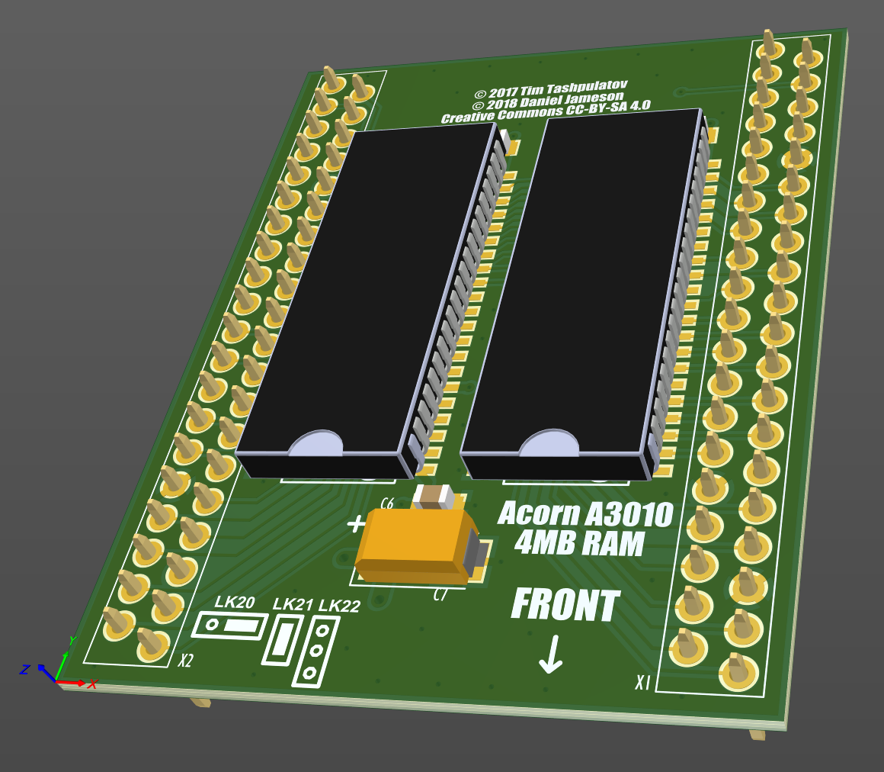

# Acorn A3010 4MB RAM card

March 2023

This is my layout update of an A3010 4MB board design originally by Tim Tashpulatov, later updated by Daniel Jameson.

This is my own layout, as an improved 4-layer design, undertaken in Altium, so there's little relation to the original repo now.

The design has proven realiable in several A3010s, including use at 'overclocked' rates up to 20MHz.

## Licence

No warranty is provided, and this work is used at your own risk.  

Licenced as CC BY-SA 4.0

Copyright 2023 Ian Jeffray
Copyright 2018 Daniel Jameson
Copyright 2017 Tim Tashpulatov
